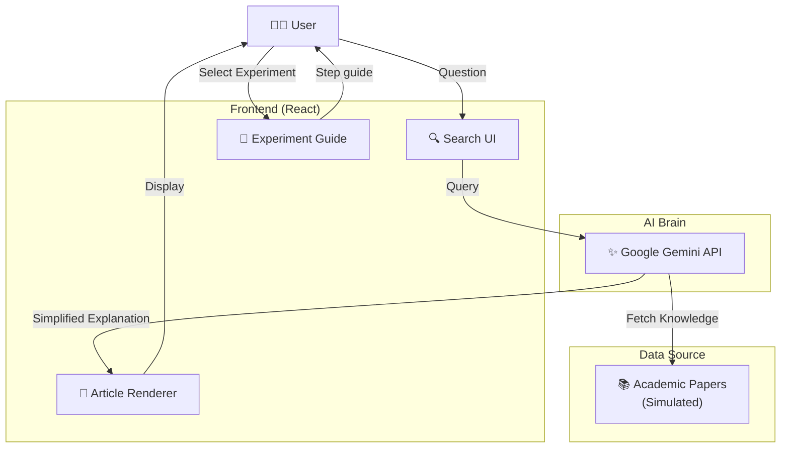

# Lifehack Alchemist - Science of Everyday Life 🔬

<p align="center">
  <b>「科学の視点で日常を解読する、知的エンターテインメント」</b><br>
  Decoding Everyday Mysteries with Science.
</p>


---

## 📖 概要 (Overview)

**Lifehack Alchemist** は、「なぜコーヒーで目が覚めるのか？」「なぜ満月の夜は眠れないのか？」といった日常の些細な疑問に対し、**科学論文に基づいた信頼性の高い解説** を提供するWebアプリケーションです。
Gemini AIを活用し、難しい論文の内容を「誰にでもわかる言葉」に翻訳。ただ読むだけでなく、家庭でできる実験レシピやクイズを通じて、科学的思考力を養います。

## ✨ Features

### 1. 🔍 Science Search (なぜなに検索)
* 日常の疑問を入力すると、関連する科学的メカニズムを解説。
* 「ドーパミン」「コルチゾール」といった専門用語も、分かりやすい例え話で説明します。

### 2. 🧪 Experiments at Home (実験レシピ)
* 特別な器具を使わず、キッチンにあるものだけでできる科学実験を紹介。
* 夏休みの自由研究や、大人の知的好奇心を満たすアクティビティとして最適です。

### 3. 🧠 Daily Science (今日のサイエンス)
* 毎日1つ、驚きの科学トリビアを配信。
* 「へぇ〜」で終わらせず、明日から使えるライフハックとして提案します。

---

## 🛠 Tech Stack

| Category | Technology | Usage |
| :--- | :--- | :--- |
| **Frontend** | **React + Vite** | Fast SPA Development |
| **Language** | **TypeScript** | Type Safety |
| **Styling** | **Tailwind CSS** | Utility-first Styling |
| **AI** | **Google Gemini 1.5** | Content Generation & Simplification |
| **State** | **Zustand** | Lightweight State Management |

---

## 🏗️ Architecture



## 📁 Project Structure

```
lifehackAlchemist/
├── src/
│   ├── App.tsx          # Main app component
│   ├── components/      # Reusable components
│   ├── pages/           # Page components
│   └── lib/             # Utilities
├── public/              # Static assets
└── index.html
```

## 🔗 Related Projects

Part of the [Enludus](https://enludus.vercel.app/) ecosystem.

## 📄 License

MIT

---

<p align="center">
© 2025 Enludus. All rights reserved.
</p>
